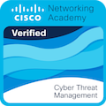
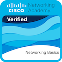
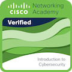

<div align="center">

<!-- BANNER -->


</div>

<div align="center">

```
╔══════════════════════════════════════════════════════════════════╗
║  IDENTITY      →  Jonathan Edward Da Silva Xavier                ║
║  ROLE          →  SOC Analyst N1 | Blue Team                     ║
║  LOCATION      →  São Paulo, SP 🇧                              ║
║  ENVIRONMENT   →  Microsoft Azure · Sentinel · Defender          ║
║  OBJECTIVE     →  Monitor. Detect. Respond. Harden.              ║
╚══════════════════════════════════════════════════════════════════╝
```

[](https://www.linkedin.com/in/jonathan-6dward/)
[](https://github.com/anakyn-1337)
[](https://kick.com/dead-s3c)
[](https://twitter.com/jonathan23jhon)


</div>

---

## `> whoami`

```yaml
name:        Jonathan Edward Da Silva Xavier
role:        SOC Analyst N1 | Blue Team
location:    São Paulo, SP, Brazil
mission:     Monitorar, detectar e responder a ameaças antes que causem impacto
mindset:     Defense-in-depth · Data-driven security · Continuous improvement
posture:     Active defense — não espero incidentes, identifico padrões antes deles
```

> *"Security is not a product, it's a process."* — Bruce Schneier

Atuo na linha de frente da defesa corporativa, com foco em **monitoramento contínuo**, **correlação de eventos** e **resposta a incidentes**. Meu trabalho não é apenas reagir a alertas — é entender o comportamento do adversário, reduzir o tempo de detecção e fortalecer a postura de segurança da organização de forma sistemática.

---

## `> operations`

<table>
<tr>
<td valign="top" width="50%">

**🔎 Monitoramento & Triagem**
- Análise e classificação de alertas em tempo real
- Identificação de falsos positivos e verdadeiros positivos
- Correlação de eventos em múltiplas fontes de log
- Priorização baseada em criticidade e contexto

</td>
<td valign="top" width="50%">

**🛡 Investigação & Resposta**
- Investigação de incidentes de segurança (N1)
- Escalonamento técnico estruturado
- Documentação de TTPs identificadas
- Análise de comportamento anômalo

</td>
</tr>
<tr>
<td valign="top" width="50%">

**📐 Melhoria de Detecções**
- Revisão e refinamento de regras SIEM
- Redução de noise em ambientes produtivos
- Alinhamento de alertas com MITRE ATT&CK
- Validação de cobertura de detecção

</td>
<td valign="top" width="50%">

**🏗 Fortalecimento de Postura**
- Revisão de políticas de segurança
- Análise de superfície de ataque
- Apoio em hardening de ambiente
- Contribuição em processos de resposta a incidentes

</td>
</tr>
</table>

---

## `> certifications`

<div align="center">

### 🏅 Cisco Networking Academy

| Certificação | Badge | Status |
|:---:|:---:|:---:|
| **Cyber Threat Management** |  | ✅ Concluído |
| **Networking Basics** |  | ✅ Concluído |
| **Introduction to Cybersecurity** |  | ✅ Concluído |

</div>

---

## `> toolkit`

### 🛡️ Blue Team — Ferramentas de Defesa

<div align="center">

| Categoria | Ferramentas |
|-----------|-------------|
| **☁ Cloud Security** |     |
| **📊 SIEM** |    |
| **🖥 EDR/XDR** |  |
| **🌐 WAF** |  |
| **🔧 Fundamentos** |     |

</div>

<details>
<summary><strong>📋 Detalhes das Ferramentas Blue Team</strong></summary>
<br>

```
☁ MICROSOFT AZURE SECURITY
   ├─ Microsoft Sentinel    → SIEM/SOAR nativo Azure · KQL · Playbooks · Workbooks
   ├─ Microsoft Defender    → XDR · Endpoint + Identity + Cloud Apps + O365
   └─ Entra ID              → IAM · Conditional Access · Sign-in Risk · MFA Analysis

📊 SIEM (Security Information & Event Management)
   ├─ IBM QRadar            → Correlação de eventos · Offenses · Rules Management
   ├─ Microsoft Sentinel    → Analytics Rules · Hunting Queries · KQL
   └─ Google SecOps         → UDM Search · Retrospective Detection · YARA-L

🖥 EDR (Endpoint Detection & Response)
   └─ CrowdStrike Falcon    → Threat Graph · RTR · Detection Triage · IOC Management

🌐 WAF (Web Application Firewall)
   └─ Imperva WAF           → Análise de tráfego web · Detecção de ataques L7 · Log Review
```

</details>

---

### ⚔️ Red Team — Ferramentas de Ofensiva

> *"Conheça teu inimigo e conhece a ti mesmo; em cem batalhas, nunca serás derrotado."* — Sun Tzu

Utilizo conhecimento de ferramentas ofensivas para:
- 🔍 **Threat Hunting** — buscar indicadores de comprometimento
- 🧪 **Emulação de Adversários** — testar detecções do Blue Team
-  **Melhoria de Detecções** — entender TTPs para criar regras mais eficazes

<div align="center">

| Categoria | Ferramentas |
|-----------|-------------|
| **🔓 Password Attacks** |   |
| **🌐 Web Testing** |   |
| **🖥 Post-Exploitation** |   |
| **📡 C2 Frameworks** |   |
| ** Reconnaissance** |   |
| **📦 Exploitation** |  |

</div>

<details>
<summary><strong>📋 Detalhes das Ferramentas Red Team</strong></summary>
<br>

```
🔓 PASSWORD ATTACKS
   ├─ Hashcat           → Password recovery · GPU accelerated · Rule-based attacks
   └─ John the Ripper   → Password cracker · Multi-platform · Format detection

🌐 WEB APPLICATION TESTING
   ├─ Burp Suite        → Web vulnerability scanning · Proxy · Intruder
   └─ OWASP ZAP         → DAST · Automated scanner · API testing

🖥 POST-EXPLOITATION
   ├─ Mimikatz          → Credential dumping · Pass-the-Hash · Kerberos attacks
   └─ BloodHound        → AD relationship mapping · Attack path discovery

📡 C2 (Command & Control)
   ├─ Cobalt Strike     → Adversary simulation · Beacon · Malleable C2
   └─ Sliver            → Open-source C2 · Implant generation · Multi-player

🔍 RECONNAISSANCE
   ├─ Nmap              → Network discovery · Port scanning · Service detection
   └─ Shodan            → IoT search engine · Exposed services · CVE mapping

📦 EXPLOITATION
   └─ Metasploit        → Exploit development · Payload generation · Post-exploitation
```

</details>

---

## `> roadmap`

```
STATUS: Q1-Q2 2025 ──────────────────────────────────────────► FUTURO

  ✅ Fundamentos de Cibersegurança
  ✅ Networking Basics (TCP/IP, OSI, protocolos)
  ✅ Gerenciamento de Ameaças Cibernéticas
  ✅ SOC N1 | Blue Team em ambiente real

  🔄 Em andamento:
     → Aprofundamento em KQL (Microsoft Sentinel)
     → MITRE ATT&CK Framework — mapeamento de TTPs
     → Threat Hunting fundamentals

  📌 Próximos passos:
     → CompTIA Security+ ou SC-200 (Microsoft Security Analyst)
     → SOC N2 — maior autonomia em investigação
     → Purple Team fundamentals (emulação de adversário)
     → Red Team / Pentest — visão ofensiva para fortalecer defesa
```

---

## `> evolution --path`

```
                      TRAJETÓRIA TÉCNICA
  ─────────────────────────────────────────────────────────────►

  [Mai 2025]           [Jun 2025]           [Jul 2025]           [Atual]
  Cibersegurança  ──►  Networking     ──►   Threat Mgmt    ──►   SOC N1
  Fundamentals         Basics               Active                Blue Team

  Base conceitual  ──► Fundamentos     ──►  Gestão de      ──►  Operações
  de segurança         de redes             ameaças              defensivas
                                            cibernéticas         em produção
```

> Cada etapa foi intencional. Da fundação conceitual até a operação real em ambiente corporativo — construindo profundidade técnica antes de velocidade.

---

## `> projects`

> 🔧 **Seção em construção** — projetos práticos serão adicionados conforme desenvolvidos no contexto SOC/Blue Team.

```
[ INCOMING ]
  ├── Detection Rules Library    →  Regras customizadas SIEM com casos de uso documentados
  ├── KQL Hunting Queries        →  Queries ofensivas para threat hunting no Sentinel
  ├── IR Playbooks               →  Playbooks de resposta a incidentes documentados
  └── MITRE Coverage Map        →  Mapeamento de cobertura de detecção por tática/técnica
```

---

## `> metrics`

<div align="center">


</div>

---

<div align="center">

```
╔══════════════════════════════════════════════════════════════════╗
║   "Defenders think in lists. Attackers think in graphs.          ║
║    As long as this is true, attackers win."                      ║
║                                           — John Lambert, MSFT   ║
╚══════════════════════════════════════════════════════════════════╝
```


</div>

</content>